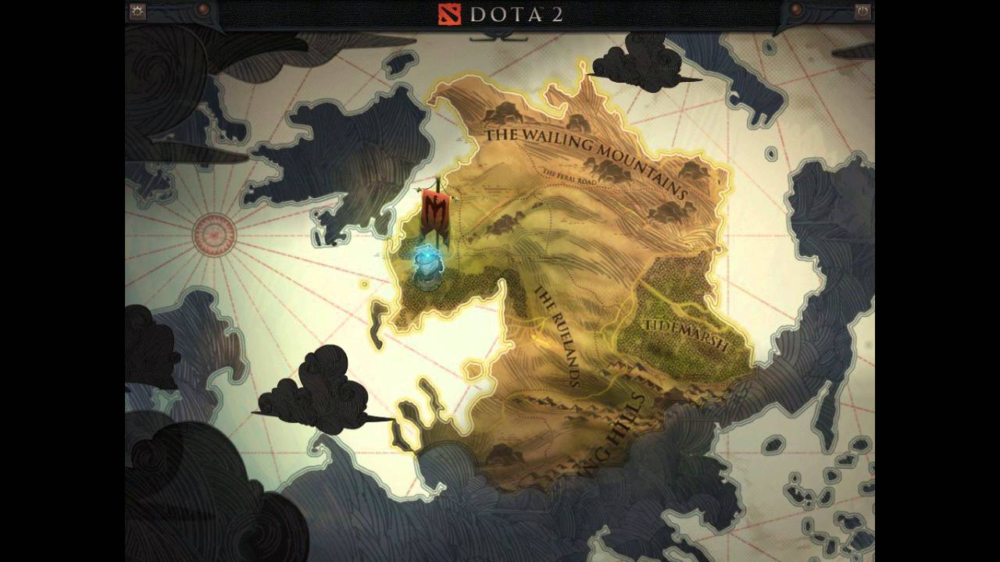
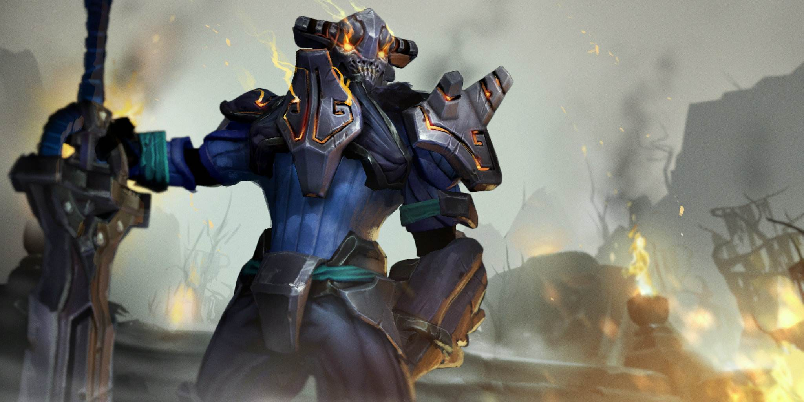
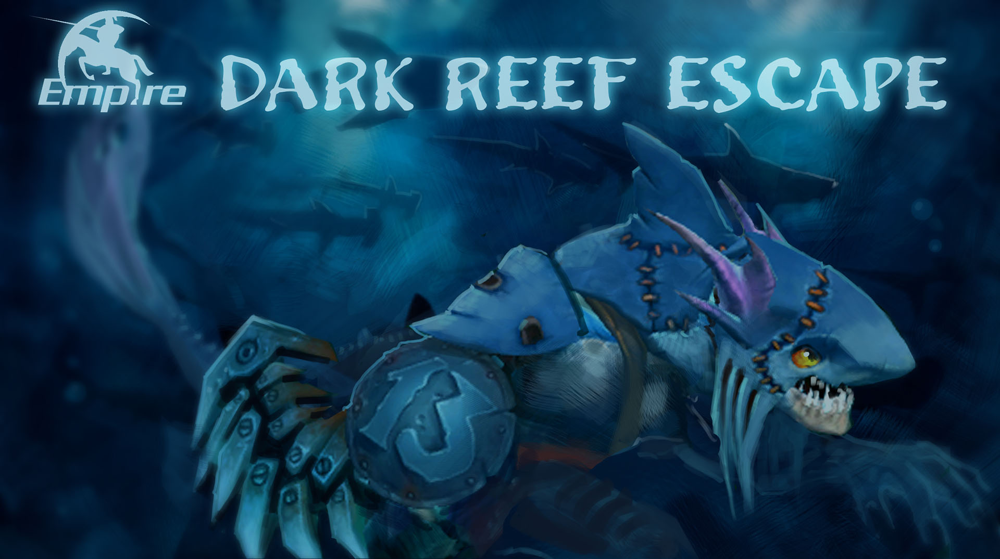
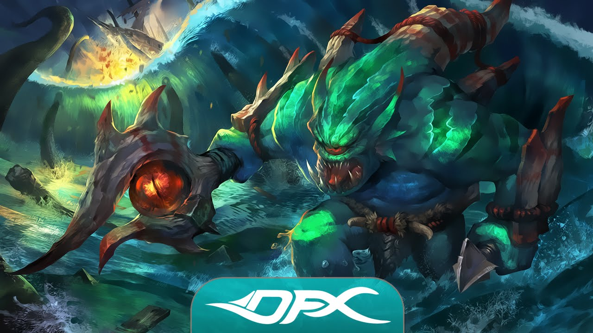
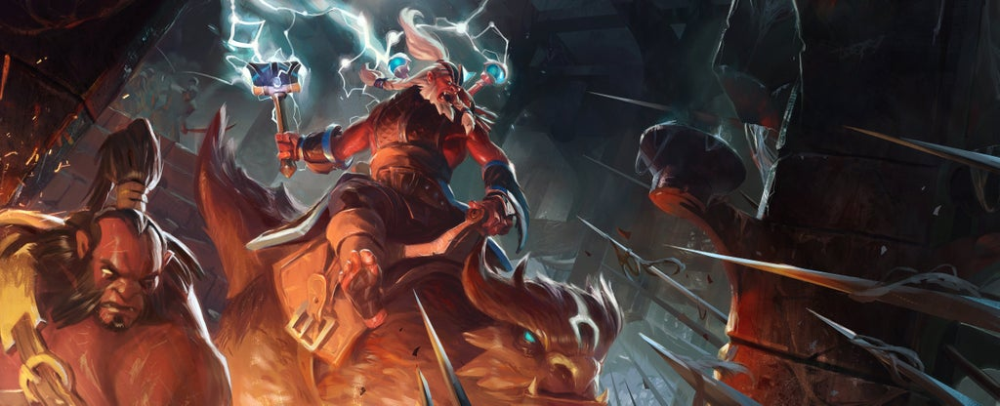
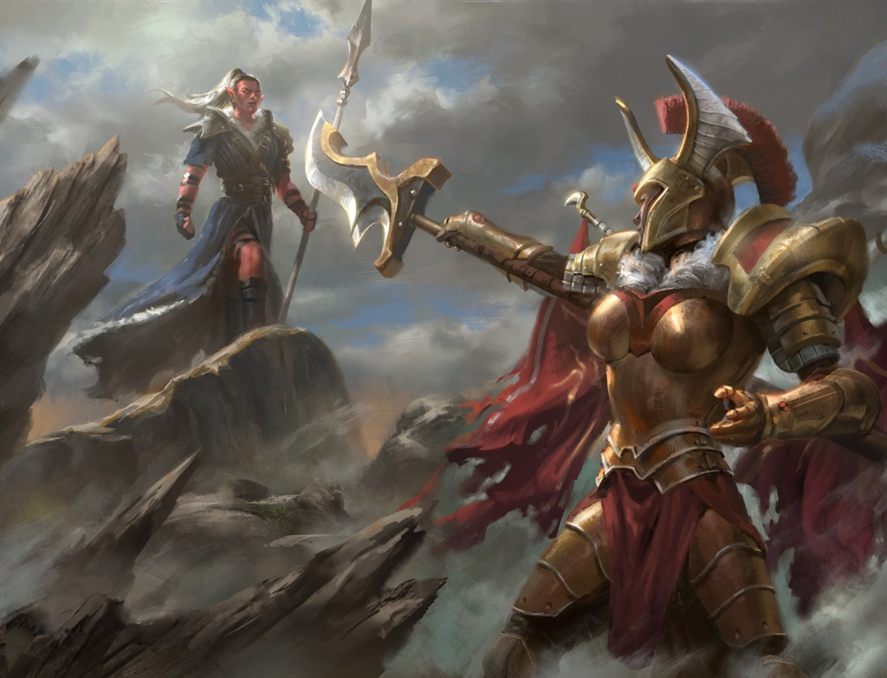

> 整理转载与Dota2游戏相关的故事背景、人物设定、历史资料等内容。

---

## 从饰品、对话、A牌描述看dota2剧情

> 以下文字转载自[（剧情向）从饰品、对话、A牌描述看dota2剧情（「诸王、列国」更新中） NGA玩家社区](https://nga.178.com/read.php?tid=17166531)

首先表明一点：以下所有内容不是为了回答「xx和xx谁在剧情里更强」这种问题而写的，也不会为了让角色有联系而强行编故事（像一些自媒体的莫名其妙的水文）。

以dota2.gamepedia.com为主要参考资料来源，国服错译将注明，一切人名/地名按个人喜好。（像魔血之欲那样把恶魔名字翻译没了，想统一按国服译法也做不到）以整理已知内容为主，形式暂定为相关英雄+地点/人物/事件为一组来说书，如时间充裕可能加入词条形式。饰品考虑作为角色的称号/事迹来讲，不会完全作为剧情采用。（我做不到全程单独把每句对话、每个饰品描述单独列出来然后再分析，工作量太大了。）

### 守夜堡，流浪骑士斯温 ...

从我最喜欢的sven背景开始。

「斯温是一名守夜骑士（Vigil Knight）的私生子，由一位苍白的南海人（Pallid Meranth）所生，于影承废墟（Shadeshore Ruins）长大。他父亲因违背守夜人法典（Vigil Codex）而被处决，母亲又因为自己的异族身份饱受疏远排挤，这让斯温坚信社会秩序、规则中找不到丝毫荣誉——只在他心中得以存在。在照顾母亲走过弥留之际后，他成了守夜骑士的新兵，对自己的出身守口如瓶。十三年来，他在父亲当年的那所学校里学习，研习着断言他是个可憎存在的古板法典。在他起誓成为正式守夜骑士的日子，他手持弃誓之刃（Outcast Blade），击碎神圣之盔（Sacred Helm），用守夜圣火烧毁了那所谓的法典（burned the Codex in the Vigil's Holy Flame）。他离开守夜堡（Vigil Keep），永远离群索居。对于自己的法典，他遵循其中最严苛的戒律（ following his private code to the last strict rune）。是的，他仍然是一名骑士，不过是...流浪骑士。他必定也只会对心中的法典负责。」（Still a knight, yes...but a Rogue Knight.He only answers to himself.）

（自己翻译的版本，国服的翻译有点小问题，可以找出来对比一下，我怕引战，不放了）

> 「守夜骑士团仍然在试图从斯温那里取回被偷走的弃誓之刃，一把能在低阶战士中杀出血路的利剑。」

> 「守夜骑士的高超技艺无人不知，斯温、野性之剑吉塔（Geeta the Wildblade，中译狂刀，我感觉守夜骑士好像都是是用大剑的）和克莱门斯（Klemens）的传奇让无数人神往。往佛雷斯花园（Gardens of Freth）随手扔块石头，都会打中一群模仿他们冒险的孩子...」

守夜骑士中的火焰守卫在守夜堡的内侧回廊（好像应该叫内部廊柱吧，不知道啥意思，我就按暗黑2里那个内侧回廊理解了）里世代保护着如斯温皮肤般苍蓝的圣火，尽管人数稀少，但成员都是举世闻名的剑术大师（可能吉塔或者克莱门斯属于这个支派？）作为整体的守夜骑士的实力如何？我们应当参照这个事实：尽管在那十三年里斯温找到了父亲当年的精铁护手，拿起了那把夸张到连成名已久的英剑门士都不愿意正面抵挡的巨剑，找到了不同于守夜骑士腐朽教条的真正属于荣誉的法典，觉醒了近身搏杀中无可匹敌的神之力量，他依旧是以一个受追杀的、积蓄复仇力量的流浪者出现的（在A牌中尤甚，可能sven那套独行兵团饰品就是他复仇的战利品之一，独行兵团是专门负责抓捕违背守夜法典的骑士的支派）。流浪骑士在冰雪覆盖的北境（莉莱背景写的cold northern realm ，她自己在冰川残骸，但也没有不能去别的地方的道理，没具体说，反正大概是沸海以南的蓝心冰川、冰盾荒原、钴蓝冰原、冰川残骸这一带吧）与蓝心守望者、水晶室女莉莱相遇，或是一场单纯的游历，或是为其他守夜骑士追杀，总之当二人再见于遗迹战场上，莉莱会问起斯温盔甲之下的身体是否还是「可爱的蓝色」，在暂无战斗的空闲里，她也会到处打听斯温的下落（「有人看见斯温了吗」，来自水晶室女播音员语音包）。「与斯温本人神似，这把大剑自有其准则，不在乎其他刀剑将作何用」，在其追逐荣誉、财富、足以复仇的力量的流浪迷途中，弃誓之刃上背负着他的哀伤、复仇之火、乡愁（死亡语音，把我葬在影承废墟）、对荣誉的不倦渴求，和他唯一遵循的法典，他痛斥全能骑士，「对盲信的骑士我全无敬意」，对于并非出于内省的「正义」他不屑一顾（对陈），对于行走人间的神明，他不惜一违（对宙斯）。在与主宰的某次战斗中，弃誓之剑劈开了其面具，寄宿其中的先祖之灵与遮面一族的最后一人合一，主宰对于这位强大骑士的无心之举颇为感激，至于他将如何报答...

（守夜骑士和鲁姆斯齐教是目前我知道的唯二不说自己信的神的情况的宗教组织，特蕾丝汀提起石堂城的神起码还说是女神，陈的教会说过神的名字，这俩真是一点没提过。）

### 大陆以南，南海游民之国、沉没之城、战栗群岛，斯拉克，司里希丝，斯拉达，昆卡，潮汐猎人 ...

其实南海人还在另外一位英雄的背景故事中提到——暗黑之礁的越狱犯人斯拉克，那么下一组说书，我们讲讲大陆以南的诸群岛和广袤海域之下的故事，涉及到：百夫长斯拉达、鱼人卫士团统领司里希丝、碧玉会的老朋友斯拉克、铁帆上将昆卡和深海潮汐之主麦尔朗恩的仆人潮汐猎人利维坦。（这段有点糙，明天再改吧，明天从深海来到高原，讲讲高地人和石堂城的故事。）

虽然我说了「大陆以南」的海域，但具体是哪片大陆，一共有多少大陆，几片海域，我们其实是不得而知的，但至少从血魔的「极刑血魔」等等饰品描述来看，这个世界不只有遗迹之战所在地一片大陆是可以肯定的。尽管多年来流传着许多爱好者自制的或详实或胡扯的世界地图，但随着七界域（Seven Planes）概念的出现和A牌地图只挖不填的态度，我们只得援引（已经不适合这个版本的）《辉夜纪》中的《召唤之海》，诗歌开篇写到：「在那大陆以外，南方以南......」
对于海中的生灵（sea-breed），（与此相对的叫法则是inhabitants of the dry world，陆地居民）我们所知甚少。暗黑之礁（Dark Reef）中囚犯的组成，应该大致涵盖了主要的海中文明种族，他们是：凶残的鱼人（ murderous slithereen）、狡诈的深海民（treacherous Deep Ones，我们很快能看到深海民不是一个具体的种族）和反社会人格的南海人（sociopathic meranths南海可能指向一个政治实体？似乎也不是具体种族）。鱼人斯拉克因在克雷城之役里浑水摸鱼，盗窃宝藏而入狱，被关入暗黑之礁，由鳗鱼和巨大海葵守卫，充斥着倒钩和比之更为恶毒可怖的同居人的深海监牢。对犯人来说，最新奇刺激的娱乐就是观赏狱卒虐杀违逆乃至试图越狱的犯人，但这机会难得，因为从未有人成功脱逃，也没有那么多傻子赶着送死，毕竟即便是最凶悍极端的恶棍也不想白白丢了命，于是大部分囚犯压抑了自己恶毒暴戾的天性，准备在此度过余生——表面如此。

斯拉克自称早就记不清入狱的原因，不过让我们看看沧海夜行者胞亲的描述「对于那些有意豪赌和一掷千金的家伙，克雷城的隐秘洞穴有着各式各样满足需要的东西。」，带着克雷城藏品的他显然不属于后者，再加上在狱中精湛的盗窃技艺，熟练的藏匿赃物的技巧，足以证明他大盗的身份。凭借着精湛的盗贼技能，他听说了十二恶棍（Dark Reef Dozen）的越狱计划，就像后者把所有可能知道风声的人全部处理掉了一样，斯拉克小心翼翼地保守这个秘密。当齐天大圣在海里引起的骚动扩散到暗黑之礁时，（这里我采用了折中的讲法，必须要承认大圣的故事有夸张的成分，要不然小鱼作为囚犯的这个特殊背景就是个笑话，同时既然邪影芳灵也说斯拉克应该谢谢大圣，我就先折中处理了。）十三位越狱者按计划行事，十人当场被格杀，两人被带回处刑，斯拉克顺手偷走了狱卒的几件装备，一路逃到了影承废墟南部的食肉森林。他与影承废墟内的黑暗支配者（Dark Ones）达成了暗影契约，在某种意义上为这些无名存在效力，（语音，为了暗影契约，为了黑暗支配者）而他取得力量的具体代价不得而知。（胜利语音，为你们的交易自豪吧，黑暗支配者）
海龙（Sea Dragon）屠戮者，暗黑之礁执法者（在斯拉达担任执法者一段时间后，暗黑之礁本来频繁的暴乱到小鱼被关进去那段时间已经算新鲜事了）、鱼人守卫（Slithereen Guard ）、深海民百夫长（Centurion）斯拉达，鱼人守卫的娜迦族统领司希里斯一道保卫深海民和丰饶富裕、满是宝藏的诸沉没城市。（小娜迦和大鱼都是百夫长，鱼人守卫应该是百人一队的军团）凭借着鱼人坚硬的鳞片、能够抵御深海水压的强悍体魄和娜迦海妖带有神秘魔力的歌声，他们在与人类、海怪（  Levianths）劫掠者对沉没城市的疯狂骚扰中百战百胜，在克雷战役的最后一战中，鱼人守卫勉强抵抗住麦尔朗恩的海怪信徒的进攻，但圣杯的失窃打破了鱼人守卫永不败的誓言，作为惩罚，功勋卓著、为克雷人爱戴、出身高贵的司里西丝遭到流放，被迫戴上头盔，不能向同类展示自己的娜迦特征，远离故土和军团，过着毫无荣耀可言的生活。（斯拉达背景没明说，为什么他没被流放？）司里西丝击杀同僚斯拉达后会说：「我不愿杀你...你怀着无缺的荣誉而终.」而当暗黑之礁的半生囚禁过后，不再信任任何人、完全丧失人性、冷酷、阴险、狠毒、与黑暗存在某易的夜行者斯拉克在远离南海游民王国，远离沉没世界的遗迹战场上遇到司里西丝时，「别理会那些批评，娜迦，我喜欢你的歌喉...唱吧，为他们送上一首甜蜜的摇篮曲...」，他想起什么了吗？
安可之刃：他只是想再听她唱一次歌。这把匕首是她送的礼物，他一直带在身边，谁敢不让她唱，那人就别想活。
当然了，司里西丝不是安可，斯拉克还记得谁是安可吗？
（这把武器就叫Encore，我是把它当成某种双关理解的，"再来一曲"的意思肯定是有的，但是是不是也在某种程度上能够暗示，赠出这把武器的人叫昂科尔（或者随便类似读音的名字）？V社似乎挺喜欢玩这种文字游戏。）

之前的描述好像把海怪说成了蛮不讲理的侵略者，可是当回顾潮汐猎人的背景的时候，我们不难发现，海怪居住在沉没群岛时，南海流民还正在与战栗群岛、海歌岛或其他海上的人类势力进行旷日持久的拉锯战，潮汐猎人对于频繁的小规模作战、人类与南海人的脆弱和平毫无兴趣，离开争端中心后成为了深海潮汐之主、深渊之神，万千触须的麦尔朗恩（abyssal god, Maelrawn the Tentacular.）的信徒，这位神明对于沉没城市中的珍宝颇有兴趣。（至于说被莱恩干死的沉没城市地狱谷里的，不断向深海扩张的堕落者布吉瓦克Far away beneath the Sunken Cities and through the Infernal Hollow, Buki'vak the Corrupted dwells in the depths forever expanding his corruption throughout the sea. 我倾向于认为和麦尔朗恩不是一个存在，道理也很简单，莱恩要是能跑到海里随便杀神，A牌里就是他追着瑞思托王廷打了。 ）
石鳞剑士唯一称之为「有风度的」人物是战栗群岛（Trembling Isle）强大铁帆海军的统帅，上将昆卡（Admiral of the mighty Claddish Navy），他出身水手世家，以捕猎别人望而却步的海兽崭露头角，从炮手到船长，再到海军上将。在秘歌港（（Port Mignin））之战后，他找到了自己日后的传奇配剑。昆卡亲自率军参与的最后一场大战役是海上诸国与洪流恶魔舰队的对抗（Demons of the Cataract、the Demon Fleet）。败局中绝望的法师召唤了先祖的亡魂，当这场三方混战将以人类的惨胜划上句号时，潮汐猎人呼唤的麦尔朗恩的愤怒将昆卡的旗舰，声名显赫的伟大战船「非凡利维坦」和战场上的一切吞没，邪影芳灵为了摆脱麦尔朗恩的恐怖力量，施法或用某些手段，加速了铁帆海军的彻底覆灭。当昆卡醒来时，发现自己被冲到了基恩人的领土，他凭借多年的海上经验帮助这些矮小的巧匠改善了基恩的海防力量，作为回报，基恩人帮助昆卡打捞并修整了非凡利维坦，将战船和深海的秘密——先祖的亡魂、深渊的邪神深锁于基恩首都，而这位前海军上将踏上了自己的复仇之旅，尽管潮汐猎人是和他一样真正热爱大海的汉子，他无法对其升起厌恶之情（ He loved the sea, Tidehunter did, and for that I cannot hate him.）——有的只是纯然的愤怒和仇恨，当然，还有追捕那该死的邪影芳灵。
（昆卡的饰品透露了一个重要信息，在狙击手口中分散了太多年的基恩族，其实在南部临海地区有牢固的政治实体。）

### 杜鲁德高原、高地人、石堂城的古铜军团，半人马战行者，斧王，干扰者，军团指挥官 ...

> 「......他获得主宰部落的地位是在古老的欧梅克斯竞技场（Omexe），半人马（Centaur ）部族千年以来聚集于此...」

> 「在狂风肆虐的杜鲁德大草原高处（High on the wind-ravaged steppes of Druud，或译为杜鲁德高原上狂风肆虐的草原？），有一位年轻且富有天赋的风暴术师，他被人称作干扰者...」

半人马部族、高地人和其他类似的强悍种群栖息于杜鲁德高原（人马对干扰者语音：让我们为高原而战Let us fight together, for the tablelands，草原的叫法也可见于战行者的饰品，草原（Steppe）战士，杜鲁德是个大高原，干扰者和半人马部落在草原部分，个人理解。）而无论是否如外界谣传的，他们都是些鲁莽粗俗的杀戮机器，高原住民不惮于称杀戮为艺术。（人马常说他的战刃在吟唱）战行者布兰德瓦登的冠军腰带和他斧下的至少百名竞技场挑战者足证他是欧梅克斯当之无愧的最强者。（血怒之斧）凭其实力他在半人马部族中享有崇高地位，由灰蹄长者（Elder Greyhoofs）授予他神圣杜鲁德号角（在A牌里叫领袖号角）由他保管，当约定之时到来，他将吹响号角，领导众部族战至最后一人。战行者离开竞技场只为与强者一战，因此参加旷世的遗迹之战，视其为来到新的竞技场开始新一轮搏杀，他只希望证明自己最强，或埋骨于欧梅克斯。他直言能与同为四足战士的马格纳斯一战颇为荣幸，对其他四足的英雄他也抱有先天的好感（小鹿、拉席克）。石鳞剑士和战行者聊起断骨氏族的猎手（Marrowfell Hunters），称希望（作为诸部族之长的）布拉德瓦登的表现能和他们（在玫叶城） 的战斗一样凶悍。（就是A牌里的Marrowfell Brawler断骨斗士，每年派强大猎手去玫叶城进行伟大的雷霆之猎，捕杀雷肤兽，这也引起了兽王的不满。同时豺狼人反抗军首领、军团指挥官的副官瑞克斯挑起的大战激发了他们的战斗热情，在玫叶城之役中半人马展开了自己的狩猎。）

> 「...由于经常受南方文明王国的侵略，几个世纪以来，高地人一直都在这片无尽的高原上为生存而挣扎...」

> 刚背兽: 我欣赏你们高地人的韧性。（对高地人英雄，已知的高地人有斧王，术士，干扰者，噬魂鬼）

> 邪影芳灵（对干扰者）：你是我见过的第一个不是狂热的杀戮机器的高地人。

> 干扰者（对术士）：术士，你是高地人里最博学的，也是错的最离谱的。

> 干扰者:斧王，我的高地兄弟。

> 斧王：斧王有表亲吗？

> （击杀） 我们有着相同的血统，不过现在你的血流干了。

杜鲁德高原上强韧、勇悍、善战的红皮肤的高地人（Oglodi）曾经建立过一个魔法、文明高度发达的伟大国家，在「暗日」中，高地王国遭到了崇拜恶魔、受伪装成人类的恶魔统治的千湖蛮族的入侵，高地之都、这座艺术与哲学的灯塔就此付之一炬。像干扰者这样有天分的风暴术士，仅仅是在遗迹中找到的自己祖先遗产的沧海一粟，便足以让他跻身英雄之列。暗日后，认为自己种族的武力孱弱导致了悲剧的高地人出走，建立了一支又一支红雾部落。高地英雄对于出身基恩族的英雄的嘲讽和敌视，或许就是因为在他们身上看到了自己种族过去的倒影，醉心于研究，而忽略了在残酷世界上的立身之本（虽然基恩族很强就是了吧）。蒙哥起初是红雾军团（the Army of Red Mist）的一名步兵（grunt，war3里的兽族步兵就是这个词，不是footman），红雾军团永不退缩的战士不仅身经百战，同时也精于铸造，亲手打造自己武装的传统也是他们强大的秘诀之一（但是斧王的制造技术似乎有点糟糕，比起锻锤他更喜欢斧子）。高地人与千湖斗士的第二次（不确定）大战、七年的千湖之境战役（the seven year Campaign of the Thousand Tarns）爆发，高地人战胜，红雾军团覆灭，蒙哥斩杀千湖人的恶魔战神，自封红雾部落可汗、斧王和红雾将军。「当红雾军团成为残尸和血污后，血雾军团填补了其空缺」，在新生军团服役一段时间后，斧王离开红雾部落四处漫游，由随从、友人小古（Goodkind）记录他的事迹，并出版成书。通过《最后的要塞》我们可以大致了解他离开血雾军团后的生活，追逐着各地的故事、传说、神话，碾压敌人、掠夺其收藏，他似乎更倾向于在大陆的中部、南部，诸如哈扎达尔废墟（陈和沉默术士的故乡）、闪烁荒漠（沙王的故乡，在沙漠王国卡尔丁附近，西部就是原来莉娜待的纷争之沙，东部我们很快说到了），暗影海岸（the shadowed coast，坑）、沃达伦（Ogdaroon，斧王的红卫之斧就是从最后的红卫手上抢过来的）等地冒险，所以小古说他的故事在奎斯（Quath，好像是军团不朽任务里提的那个城，存疑？）、科尔城（Col city，坑）、乌哈图（Uhatu，我看的版本好像没翻译这个地名，坑） 、钴蓝冰原（Cobalt，巨牙海民常待的地方）、迷雾港（Smoke Harbor，坑）、女妖城（Banshy，坑）等北方地区并不那么受欢迎，为了提升声望，与英雄、众神一战，他从哈扎达尔北上参加遗迹大战。

> 邪影芳灵（以下均为对斧王语音） :庆幸我比索拉先找到你吧。

> 石鳞剑士：在和索拉可汗打过之后，你显得真羸弱。

> 剑圣至宝：斧王，等这场战斗结束，我们必须讨论如何对付索拉可汗。这就是索拉可汗取代你位置的原因。

> 屠夫至宝：索拉会剥了你的皮，不过肉归我。

剑圣、邪影芳灵、石鳞剑士、屠夫都曾经谈起索拉可汗（Sorla Khan），这位在A牌里逐渐为我们所知的高地首领。敌视着蒙哥的她统领红雾部落的主力——血雾军团和重组的红雾战士。石鳞剑士对于自己爽约，没能帮干扰者脱离红雾军团十分愧疚。这可能导致了干扰者被迫踏上千湖之境、玫叶城战役的血腥战场。

下面来说说玫叶之战的另一方。

古铜军团攻克开恩城后，十五岁的奴隶特蕾丝汀因为挑衅古铜士兵被打得半死扔进准备埋尸体的坑里，她爬出来、溜进军团，从喂马的侍从成长为古铜将军。特蕾丝汀与其副官马库斯远征莫尔比克城二百一十七天后，古铜军团连下两城，莫尔比克城，与咖啡和诗人之城布利尔，当天夜晚，正在撤军回石堂城的军队发现石堂城上空闪烁着诡异光芒，黑曜石城市艾兹尤格的大军自地下深渊涌入这个世界。尽管血战过后，特蕾丝汀作为军团的最后一人击败了孽主，但牛头蛇之主加拉尼乌斯大帝已经和他的都城一道成为历史。（孽主可能就是在这场决斗中弄丢了他的深渊之刃）
在神器artifact影响下历史发生了变化，本应死于洛琳·拉山领导的碧玉会（Jasper Circle ，dota2译为圣刀会，以下统一使用A牌译法）刺杀的索拉可汗带领高地军团南下，特蕾丝汀老成的副官马库斯变为了来自赤喉的豺狼人瑞克斯（Rix）和石堂军官、特蕾丝汀的爱人贝勒桑诺。古铜军团向东南方扩张大胜，返回石堂城之际，西北方而来的高地人已经拿下了灰烬城，劫掠沿途所见的城寨、村舍，意图围攻塔林城，直取石堂。塔林曾为伟大的塔林王朝统治，这座城市或正是因此得名，皇室在一场叛乱中一夜倾覆——二皇子力丸，我们熟知的隐形刺客凭借其矮小身形和天生的隐匿技能得以脱逃。对于特蕾丝汀来说颇为幸运，塔林人的城池在所有牛头蛇旗帜飘扬的土地上数一数二的坚固，同时她意识到，索拉可汗不会在此和古铜军团进行旷日持久的拉锯战，考虑到北方不远处还有一条道路通向石堂城，军团指挥官派遣副官瑞克斯前往灰烬城东部的玫叶城（Roseleaf）向他的同族征粮，组织防御，自己则北上面见议会和加拉乌尼斯大帝，为自己的军团争取援军。

特蕾丝汀的失误有二，但其实出自同一原因：她没意识到自己侍奉的君主，带领的军团，效忠的国家，尽管强悍无情，但也同时残暴、固执、自满。就像石堂城王者「暴君」的名号和米瑞斯嘉对她说的，随古铜军团的征服而来的并非有序的统治而是暴政。军团指挥官没有得到更多的战争补给和人手，而「出身低微」——确切说，作为被征服种族一员的瑞克斯挑起了一场叛乱。稍微看一眼A牌里的地图不难发现，玫叶城并没有像其他城市一样的缩略图，被森林围绕的它更像是村寨的集合（所以说玫叶城这个翻译，总觉得不太好），事实上，「玫叶」这个名字就是原住民豺狼人与森林中的不朽树精友好关系的体现，尽管过去豺狼人最终被石堂城奴役，但在瑞克斯的号召之下，这场反对暴政的革命日渐浩大。古铜军团、红雾军团、豺狼人/树精革命军三方势力，和与之相关的十几位英雄围绕玫叶展开大战，这就是A牌为我们讲述的大事件「玫叶之役」。据邪影芳灵所述，她来到遗迹战场已是数年之后，玫叶早成为了废墟。而这条世界线下石堂城和古铜军团的命运，可能因为A牌的惨淡（这个词是不是太给它贴金了？）永远不为我们所知了。（至于和玫叶战役相关的，三国组成的商贸联邦瑞文特尔与幻影神谕者领导的幻影之纱的恩怨，赛勒蒙妮的暗月、晴雪城的全能骑士和影魔领导的瑞思托王廷的暗中争斗，垂枝玫瑰评议团雇佣的法师凡妮莎和冰女的老师之一、蓝宝石执政官皮尔庞特的危险物品回收之旅，戮尽之地的不死亡灵和圣女安苏领导的鲁姆斯齐教、叛教的枢机主教瘟疫法师的长久仇恨，阿哈利姆圣所的门户大开引起的泰勒庄园联合敌法师紧急行动......都会讲的，别着急。）

... 待补充