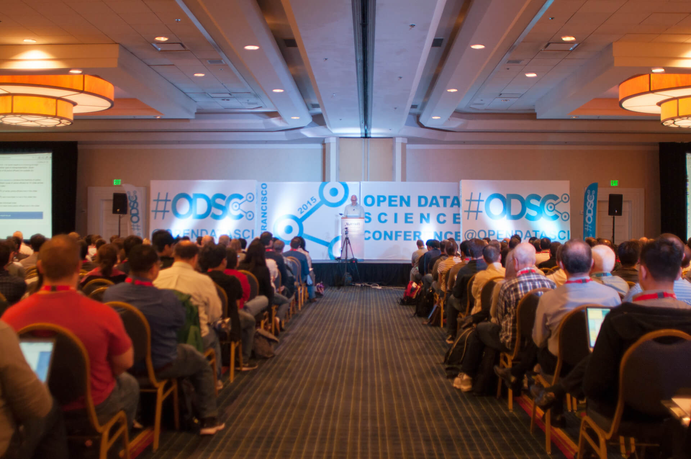

[开源数据科学论坛](//www.odsc.com)（Open Data Science Conference，简称ODSC），是一个全球性的关于数据科学的盛会，它的主旨在于为每一个想要学习数据科学和想为开源项目贡献力量的人们创造一个与全世界的数据科学社区进行交流的机会，并以此来加快技术创新和开源软件发展的步伐。

作为一个全球性的数据科学论坛，ODSC会在今年分别于北美、欧洲、亚洲举办六次聚会，总共将会有350多名数据科学界的佼佼者进行演讲，并有超过2800个公司的一万多名出席者参加会议，与会者的年龄大多在25岁至44岁之间。会上将会讨论现在数据科学和开源项目中的各个热点话题，包括机器学习、预测分析、深度学习与神经网络、数据可视化、大数据分析工具等。

ODSC会邀请当今数据科学界中的顶尖教授以及来自知名企业和学校的相关从业人士前来演讲，包括雅虎、沃尔玛、IBM等大型企业的数据科学工程师以及scikit learn等知名开源项目的核心贡献者等等。ODSC成为了一个很好的向公众展示数据科学魅力的平台，也是一个普通数据科学从业者倾听业界顶尖人士经验、学习各类数据分析方法和思路的绝佳机会。

以即将在10月召开的ODSC in London为例，千余名数据科学家、创业者将会在为期两天的活动中共同讨论网络、机器学习以及数据训练相关的内容。会上将会介绍使用各种开源工具进行数据分析工作的具体方法（包括R、Python、Hadoop等程序语言与框架的使用技巧），并会提供一系列的项目供参会者进行分析和测试。活动同时会提供来自30多个公司的200多个数据科学相关职位的招聘环节。可以说，对于我们每个数据科学从业者或是对数据科学感兴趣的人而言，参加ODSC将会极大地提升我们的专业能力，同时也可以为我们带来全新的机遇。

目前ODSC在Santa Clara和London的活动已经开始招募与会人员，我们也将会持续关注会议的相关动态。