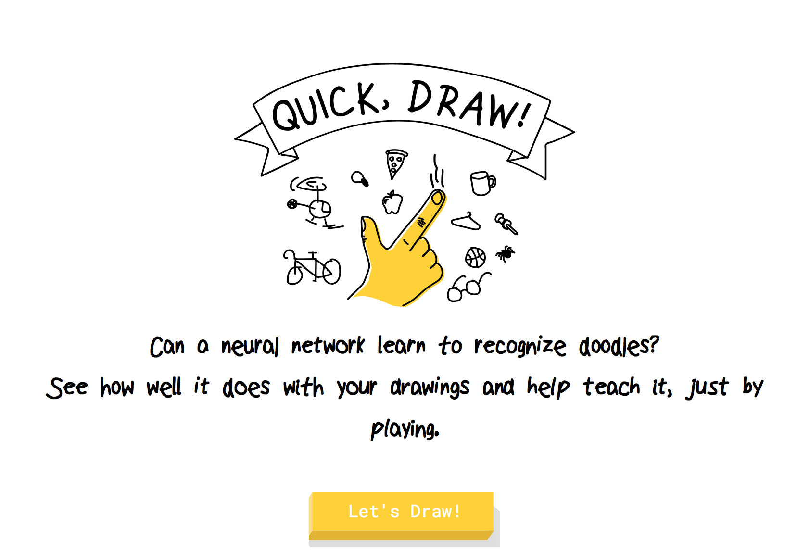
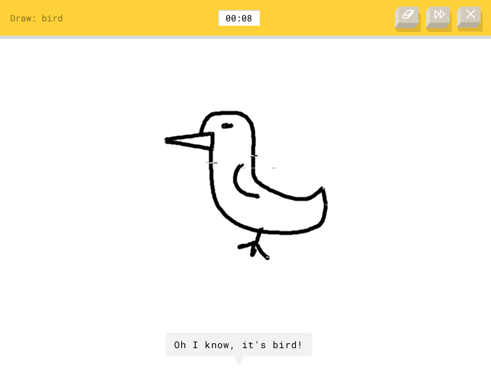
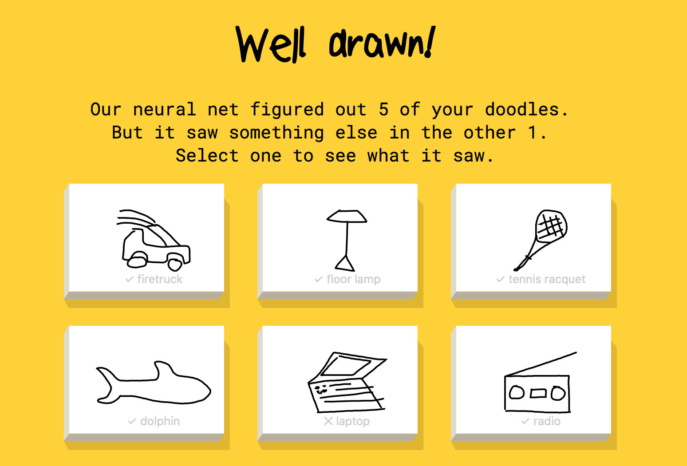

Google刚刚发布了一个很有意思的[网页小游戏Quick, Draw!](//quickdraw.withgoogle.com)，这个游戏比较类似于前几年很火的手机游戏你画我猜，但与之不同的是，Google这次给你安排的对手不是人类，而是人工智能。

游戏规则是这样的，网页要求你在20秒内在屏幕上绘制一幅关于某个实物的简笔画（比如说小鸟、卡车等等），让Google的人工智能系统来同步猜测你所画的内容，当猜测结果与你的目标一致时游戏通过。

当完成六次游戏后，系统会给出一个总览图，你可以点击每一幅图片来观察AI的识别结果并浏览其他人的绘制结果。你也可以通过社交网络分享你的绘制作品，吸引更多的人来参与到游戏中来。

游戏本质其实就是一个图像识别分类过程，系统通过清洗、分析图形的特征，来判断图形的真正含义。图像识别技术一直是人工智能的一个重要组成内容，也是Google所一直努力的研究方向之一，一个优秀的图像识别模型可以广泛地应用于图片检索、媒体内容归类、视频监控等多个领域。这个游戏同时也是[Google的A.I. Experiments项目](//aiexperiments.withgoogle.com)中的一员。Google一直保留着一个很好的传统，就是将其掌握和正在研究的各类项目转化为有意思的小实验来让普通用户体验和测试（比如之前的Android Experiments和Chrome Experiments），这样不仅能让更多的人了解前沿技术，也能极大地增强企业影响力。比如去年的AlphaGo，就直接让深度学习这样一个比较艰深的机器学习方法广为人知。

而用游戏的方式来让大众参与到机器学习过程中还有另外一层用意。机器学习需要海量的训练数据，而高质量的训练数据往往是比较难以获得的，因此，让大众参与其中并贡献数据是一条非常好的道路。根据Google的说法，Quick, Draw!游戏在发布之初仅使用了数百个训练数据，但经过众多玩家的参与和游玩，目前系统的识别率已经相当好，而且能识别出不同形态的同一物体（比如说对于宽檐帽和鸭舌帽的图形，系统均能准确地识别出是“帽子”）。

<iframe src='https://player.vimeo.com/video/192022142?color=6c9bcf&title=0&byline=0&portrait=0' frameborder='0' webkitallowfullscreen mozallowfullscreen allowfullscreen></iframe>

目前看来，Google可能并不是机器学习与人工智能技术领域最顶尖的，但绝对是最富新意和创造力的。Google很好地将其所拥有的尖端技术以游戏等方式分享给大众，让大家一同参与到各种实验项目之中，从而让普通人也能领略到目前计算机科学的伟大和惊人之处。

