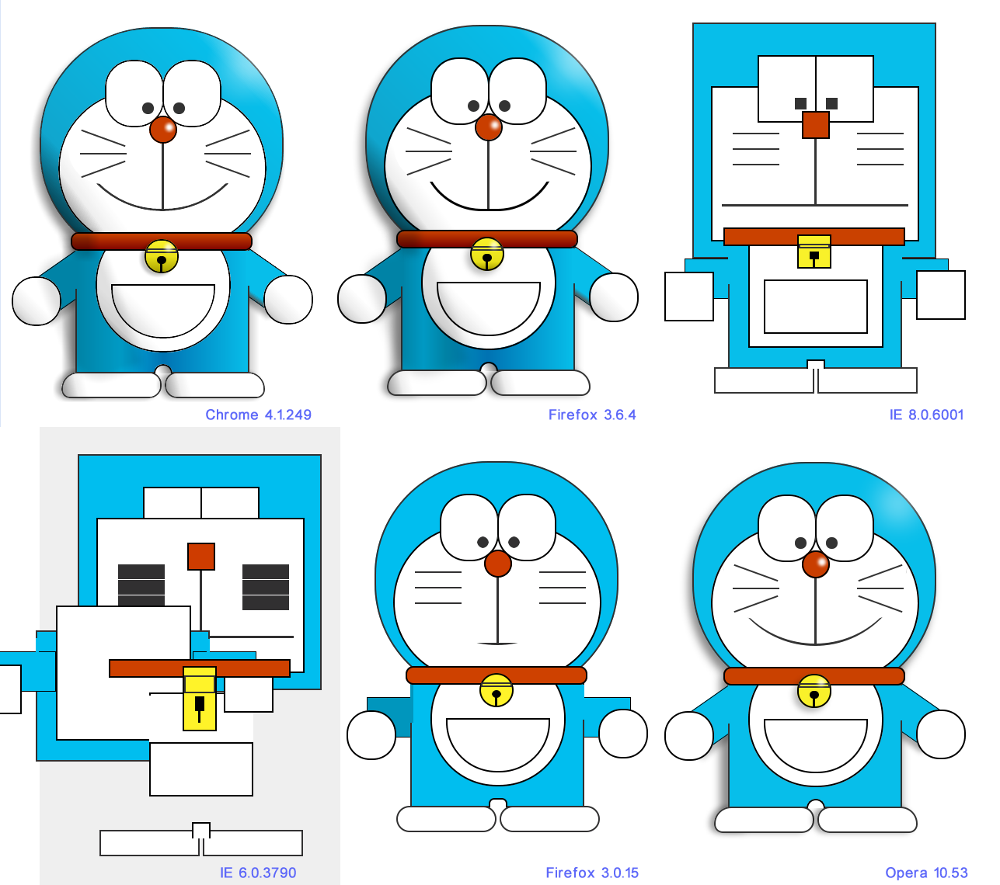
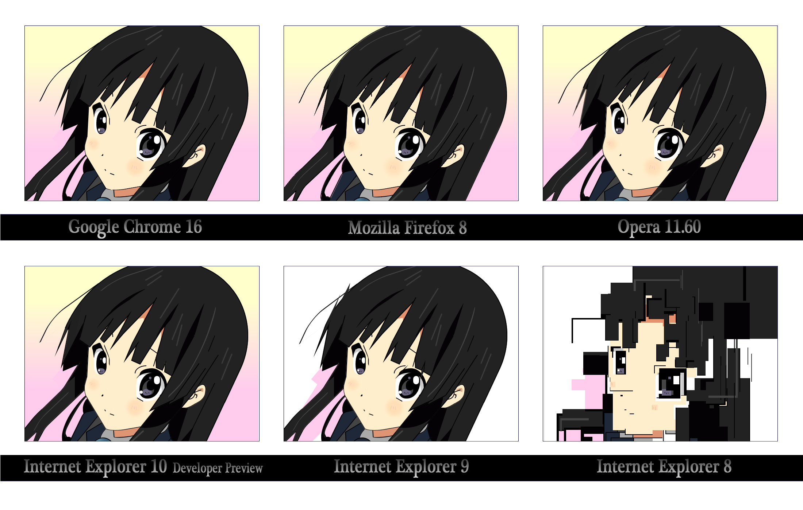

大家都喜欢各式各样的卡通形象，比如Hello Kitty、加菲猫等等，但并不是所有人都能有创作这些卡通形象的过人画工。对于我们很多人而言，常年与电脑相伴的生活早就使我们忘记了如何持握画笔，如何去勾勒线条。但是你知道吗？完全不用画笔，也不需要多少绘画经验，仅仅需要一些简单的代码就能够创作出色的卡通形象。

对于喜欢前端开发的同学来说，CSS（层叠样式表）应该并不陌生，我们使用HTML来构建网页框架，然后使用CSS来确定网页中各个元素的属性，使网页清晰而且易读。但是互联网技术发展到现在，CSS的功能已经远远不止于安排网页元素的层次关系这么简单，我们完全可以使用HTML＋CSS来画画。几年前，网络上流传着一张由日本工程师设计的用CSS绘制的哆啦A梦的作品，这幅作品很好地体现了现在CSS所支持的几类高级渲染功能（如渐变、圆弧、倾斜变换等）。可惜的是，当时并不是所有浏览器都支持这些高级特性，比如已经死去很久的IE6。

为了了解使用纯CSS进行图形绘制的一般方法，接下来我们将以一个较为简单的卡通形象——蜡笔小新的脑袋作为案例来讲述具体的设计过程（如题图所示）。

首先我们需要要确定网页中元素的层次关系。这一步和使用Photoshop等绘图工具进行创作有些类似，我们同样需要一些类似于图层概念的元素来帮助我们确定定位关系。对于绘制人物形象而言，一开始的工作自然就是划分五官，然后逐步进行设计。首先，我们在HTML文件中添加如下元素。

<iframe src="//jsfiddle.net/shinoring/sqx5fp3e/embedded/html/"></iframe>

人物头部形象一般会包括面部、头发、眼睛、眉毛、耳朵、鼻子和嘴巴。小新的鼻子因为画风的关系在大多数情境下都没有画出来所以我们可以不予考虑。

下面我们将在网页中逐步添加新的子元素并设计元素属性。为了方便图形的定位，我们将所有元素的`position`属性都设置为`absolute`并简单地通过`left`和`top`来标定位置关系。元素的位置和尺寸属性可以自行调整，在下文中不多加赘述。

首先我们来看脸的画法，我们可以发现小新的脸可以简单地看作一个圆形和一个圆角矩形组合而成。绘制圆角矩形的方法比较简单，使用CSS中的`border-radius`属性即可。我们可以简单地加上一点倾斜效果让画面更加自然。

<iframe src="//jsfiddle.net/shinoring/fxmffLr5/4/embedded/css,result/"></iframe>

仔细观察可以看出，卡通形象一般会有比较明显的深色边框。这里的做法是重新使用两个带`border`的元素衬于图形底部用来实现边框效果。为什么要重新用两个元素呢？是因为面部图形是由两个元素组合而成的，如果直接加上边框属性则会产生交错。

耳朵的画法稍微麻烦一点，我们注意到耳朵实际上是一个椭圆被切去了一小部分，这里可以用`overflow`这个属性来实现切边效果，即使用一个外部容器然后设置`overflow:hidden`并调整图形的位置来截去图形的一部分。头发的绘制过程与之类似，也是由两个黑色的弓形图形构成。

<iframe src="//jsfiddle.net/shinoring/m22xLq6w/2/embedded/css,result/"></iframe>

眉毛的形状需要动一点脑筋，实际上它们是两个带圆角的弧形，我们用一段弧加上两个圆点来完成这个形状，弧形的画法同样是使用一个外部容器截取一个黑色的圆圈。

<iframe src="//jsfiddle.net/shinoring/scfwejtn/1/embedded/css,result/"></iframe>

眼睛的画法就比较简单了，直接画两个同心圆就可以。嘴巴也一样，就是一个暗红色的椭圆。

五官都绘制完毕之后，我们的工作就基本完成了。为了使图形更加生动，我们还可以增加一点动画和渐变效果。下方是绘制结果的一个示例，你可以通过点击按钮来观察图形元素的构成细节。

<iframe src="//jsfiddle.net/shinoring/jf1hpnn9/1/embedded/result/"></iframe>

这样我们就得到了一个CSS绘制的卡通形象作品，可以看出，这个过程和传统的平面图形设计流程是比较类似的，只不过我们没有使用任何绘图工具，而仅仅是使用代码来完成所有的工作。当然，现在我们已经可以使用一些工具来更加便捷地绘制CSS图形，来自[CSS-Tricks的这篇文章](//css-tricks.com/examples/ShapesOfCSS/)就介绍了一些常见图形的绘制方法，包括多边形、心形等等。

最后值得一提的是，CSS绘制的图形渲染效率是比较差的（远不如SVG格式的矢量图形，更不如图片或WebGL），因此在实际工作中需要谨慎使用。当然，了解CSS的高级特性，对于我们还是很有帮助的。现在无论是在交互设计还是在前端开发领域中都需要开发人员对于CSS所支持的高级绘图属性和动画渐变属性有着充分的了解。至少我们可以认识到，我们所面对的冷冰冰的代码，也可以拥有一副天真可爱的面孔。

