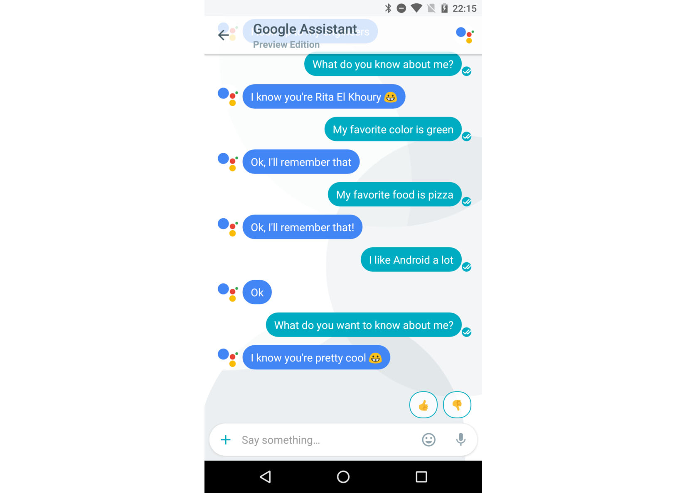

无论人工智能技术如何发展，只要人类还不愿意直接让机器统筹一切，就必然要涉及到如何进行交互的问题。从鼠标到多点触摸屏，人机交互模式在不断地演化和进步。而来到人工智能时代，我们终于可以脱离工具的范畴，来使用我们最熟悉的交互方式来控制设备——语言。

我们需要各种ChatBot，需要足够智能化的智能助手，这不仅是因为语言交互模式足够便捷，更重要的，面对越来越多的物联网设备和可穿戴设备，语言交流将会成为唯一的交互方案。而对于任何人工智能产品，无论是自动驾驶汽车还是智能办公设备，语音助手必定会成为重要甚至是不可替代的组成部分。

因此，没有任何一家科技公司会忽视AI助手的技术和发展状况。

## 时代的领跑者

打造一个可用的、足够智能化的AI助手是极其困难的，因为整个语言交互过程涉及到语音识别、句子切割、语义分析、算法处理以及语言反馈等种种复杂的过程，而且虽然我们现在拥有了足够成熟的机器学习技术，但是我们还是难以一蹴而就地解决这些所有的问题。根据现在的人工智能发展阶段，研究AI助手有两个要素不可或缺。其一：足够领先的NLP技术；其二：拥有海量、优质的语言交流数据集。

这就是为什么只有Google、Apple和Amazon走到了这个领域的前列。

Google Assistant可能是现在最优秀的智能语音助手。这不仅仅表现在它能够充分理解各种复杂的语言指令（包括多语言混杂的句子），而且能够依托Google搜索引擎的海量知识库给出足够精确的回答。而更为关键的，Google提出了[一些很有建设性的方案](http://www.androidpolice.com/2016/09/22/chatting-with-google-ways-assistant-replaces-augments-ok-google-now-on-tap/)来提高智能助手的表现。比如说「记忆」。

Google Assistant中包含有对于上下文的记忆——而如果是在某个第三方App中使用，它还会采集到你在这个App中的某些信息。也就是说，Google的智能助手可以完成类似于这样的工作：你想去某个地方，然后就让Google帮你打了辆车，然后你对Google说你饿了，Google可以给出你位于目的地附近的推荐餐厅和特色菜。这样的一套流程无疑更加自然，也更加智能化。

但由于Google对于AI助手的定义仍然偏重于解决实际问题，因此对于很多人来说，Google Assistant并不是一个很好的聊天伙伴，而是经常冷冰冰的给出一些很死板的答案。

Apple所带来的Siri也许是现在最广为人知的语音助手，但是大家对于Siri的普遍概念还仅仅是iPhone上的一个玩物。一直以来，由于Apple生态系统的封闭性，以及他们对于尖端技术的谨慎态度，大家对于Siri背后的技术都不甚了解。但随着Apple渐渐开始向人工智能领域贡献资源，人们开始渐渐发现Siri中所使用的[一些独有的解决方案](https://www.cultofmac.com/498930/apples-machine-learning-blog-sheds-light-siris-secrets/)，包括不间断地学习用户兴趣和发音习惯、动态调整语音响应的敏感度等等。

虽然我们并不会经常听到有关于Amazon Alexa的技术新闻，但这款来自于新任世界首富贝索斯的公司旗下的产品早已应用甚广。依托于Amazon的开放态度以及其与电器制造商的良好关系，[数以千计的智能家庭设备上](https://www.cnet.com/smart-home/compatibility/amazon-alexa/)早已内置了Alexa，并依靠Amazon丰富的内容和产品库为用户提供各种服务。

## 挑战与尝试

很遗憾的是，我们并不能将微软——这个PC时代的霸主旗下的相关产品列为第一梯队，因为PC巨人在移动领域和家庭领域的布局可以说是完全失败，这导致其在智能助手上的技术完全找不到合适的表达场景。Cortana虽然有趣、好用、功能强大，但是对着电脑一个人傻傻地说话毕竟会让人觉得很奇怪。但微软在市场上的失利并不会影响到它在技术方面上的某些亮点，比如说他们使用twitter来建立智能聊天工具这样的尝试。

直到现在为止，大部分与智能助手相关的机器学习研究方向还都是限于有监督学习。具体一点就是研究人员要预先为用户的表达意图划分出若干场景，不同场景下智能助手的处理方式并不相同。而微软的这次尝试很有意思，他们让AI通过twitter这样一个海量的语言资料库去自动学习和掌握语言回答方式（这个AI名为Tay）。这样的尝试是很有意义的，但是结果却很让人意外——很快Tay就变成了一个[满嘴脏话、并且充满种族歧视态度](https://techcrunch.com/2016/03/24/microsoft-silences-its-new-a-i-bot-tay-after-twitter-users-teach-it-racism/)的「怪胎」，并迅速被官方所关闭。这一现象很大程度上是因为twitter的语料库根本算不上是多么优质的数据集，近朱者赤近墨者黑这句话用在AI身上也完全合适。

有趣的是，Facebook也搞过类似的实验。小扎的实验室曾经尝试让两个ChatBot进行相互交流，以期它们能够通过相互联系提高语言沟通效率。但是后来，同样意想不到的事情出现了，两个ChatBot开始[用一些人类所无法理解的语言进行信息交换](http://www.independent.co.uk/life-style/gadgets-and-tech/news/facebook-artificial-intelligence-ai-chatbot-new-language-research-openai-google-a7869706.html)，天知道它们是不是在讨论一些灭绝人类之类的话题。因此，这个项目也被迅速叫停。

诚然，这种无监督学习的尝试毕竟是好的，因为它代表了人工智能真实的发展方向。但是，如果脱离人类控制，人工智能的发展将可能存在危险的元素。越来越多的案例开始说明，钢铁侠马斯克的「[AI危机论](https://www.cnbc.com/2017/07/16/musk-says-a-i-is-a-fundamental-risk-to-the-existence-of-human-civilization.html)」并不是危言耸听。对于AI助手的研究，可能还需要更加谨慎一点才行。

很显然地，这个领域内的搅局者越来越多。前不久，Yandex——俄罗斯的搜索霸主——发布了一个名为Alice的AI助手，这个智能助手最有意思的地方，就是它能够[让用户随心所欲地交流任何事情](https://yandex.com/company/blog/say-privet-to-alice-yandex-s-intelligent-assistant/)，而不仅仅是回答指令。也就是说，Alice会更加人性化一点。据称，他们的研究人员实现了一个基于神经网络的「chit-chat」引擎来完成这一切，而这一特性会让用户觉得更加舒适。

而最新的，一家新的公司带来了一款名为TeleX AI的号称有革命性意义的ChatBot。目前而言，这个ChatBot据称还只能[在Telegram上来存储和交换比特币](https://themerkle.com/telex-ai-to-offer-digital-currency-trading-services-directly-on-telegram/)（洗钱？），其他的技术优势尚不清楚。但是毫无疑问，AI助手在越来越多的领域中将会担任更加重要的工作，甚至包括财务管理方面。

## 发展与想象

也许你还觉得使用语音来控制你的一切设备还比较遥远，可事实是，你甚至都可以开发属于你自己的聊天机器人了。包括IBM提供的Watson平台以及已经被Google收购的api.ai（现已更名为DialogFlow），科技巨头们开始为普通开发者提供良好的智能助手搭建平台和机器学习环境，任何人都可以在自己的项目和产品中插入智能化的聊天工具，为用户提供更为直观便捷的服务。

而事实上，国内外关于智能助手已经有了越来越多的尝试和发展，不少公司开始试图探索语音聊天机器人在心理辅导、抑郁症治疗以及老年人和残障人士呵护项目上的潜力，而语音助手在语言情感以及人性化上都在渐渐提高。面对已经有国家授予机器人公民身份这一事实，我们已经可以充分畅想，像钢铁侠那样呼唤贾维斯为自己处理一切事物的生活已经并不只是概念了。

